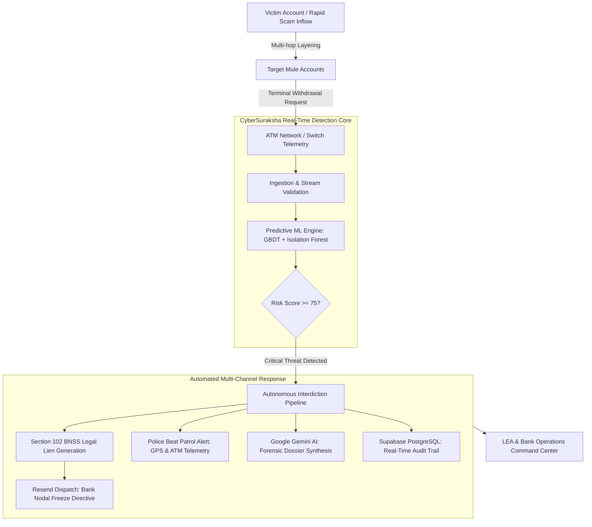

# 🛡️ CyberSuraksha (SIH 26184)
### *AI-Powered Real-Time Predictive ATM Cashout Interdiction & Automated Mule Account Freezing Platform*

[](https://www.sih.gov.in/)
[](https://www.sih.gov.in/)
[](https://nextjs.org/)
[](https://fastapi.tiangolo.com/)
[](https://supabase.com/)
[](https://aistudio.google.com/)
[](LICENSE)

---

## 📌 Executive Summary

Modern cyber syndicates execute **rapid multi-hop mule account transfers** followed by simultaneous **coordinated cashouts across decentralized ATM networks** within 12 to 25 minutes of phishing, ransomware, or digital arrest scams. Traditional post-incident banking forensics fail because funds are already withdrawn in physical currency before a manual lien can be applied.

**CyberSuraksha (SIH 26184)** is a sovereign-grade, automated interdiction system designed for the **Indian Cyber Crime Coordination Centre (I4C)**, law enforcement agencies (LEAs), and scheduled commercial banks. By combining **predictive machine learning (ML)**, **real-time ATM telemetry tracking**, **Google Gemini LLM forensic brief synthesis**, and **autonomous Section 102 BNSS legal lien dispatch**, the platform detects cashout anomalies before or at the moment of withdrawal, instantly freezes target mule accounts across interbank rails, and dispatches tactical GPS coordinates to nearby police beat patrol units.

---

## 🌟 Key Capabilities & Features

### 1. ⚡ Autonomous Section 102 BNSS Interbank Lien Freezing
- Automatically triggers statutory freeze notices under **Section 102 of the Bharatiya Nagarik Suraksha Sanhita (BNSS)**.
- Compiles cryptographically signed, court-admissible PDF freeze notices with transaction hash, beneficiary trail, and reason code.
- Dispatches automated high-priority freeze directives to registered Bank Nodal Officers via **Resend API**.

### 2. 🚨 Tactical Beat Patrol & PCR Van Geofence Dispatch
- Tracks live ATM incident locations and correlates them with real-time suspicious transaction clusters.
- Automatically dispatches emergency SMS and tactical email alerts containing exact GPS coordinates (`latitude`, `longitude`), landmark references, suspect profile data, and vehicle dispatch recommendations to on-duty patrol officers.

### 3. 🧠 Multi-Tier Predictive Cashout Engine
- **Velocity & Hop Analysis:** Detects rapid layering across 1st-hop, 2nd-hop, and terminal mule accounts.
- **Geospatial & ATM Anomaly Modeling:** Identifies erratic withdrawal spikes outside normal customer behavioral profiles.
- **Explainable Fraud Scoring:** Computes risk indices (0–100) with granular risk indicators (e.g., Velocity Spike, New Device ID, Rapid Cashout Pattern).

### 4. 🤖 Google Gemini 1.5 Flash Forensic Intelligence Briefs
- Ingests complex financial graphs, mule hop history, and KYC metadata.
- Generates natural-language executive forensic dossiers and immediate action recommendations for Cyber Cell investigating officers in seconds.

### 5. 🗺️ High-Resolution OpenStreetMap Incident Operations Map
- Interactive geospatial command map displaying active ATMs, cashout nodes, suspect hotspots, and police patrol coverage areas without proprietary watermark restrictions.
- Custom color-coded indicators for high-risk, moderate-risk, and secure withdrawal terminals.

### 6. 🔐 Sovereign-Grade Security & Authentication
- Protected by **Supabase Authentication** with password verification and seamless **Google OAuth 2.0 Single Sign-On (SSO)**.
- Enforces strict PostgreSQL Row-Level Security (RLS) policies ensuring only verified law enforcement and banking officials access forensic data.

---

## 🏗️ Architecture & Data Flow



---

## 💻 Technology Stack

| Layer | Technology | Purpose |
|---|---|---|
| **Frontend Framework** | Next.js 15.3 (App Router), React 19 | Modern, server-rendered dashboard with reactive telemetry |
| **Language** | TypeScript | Strict type-safety across forensic models & schemas |
| **Styling & Icons** | Tailwind CSS, Lucide React | High-contrast, tactical dark/light operational UI |
| **Mapping Engine** | OpenStreetMap, Leaflet / Custom Tiles | Zero-watermark real-time incident mapping & hotspot clusters |
| **Backend API** | FastAPI (Python 3.11+) | High-throughput asynchronous risk calculation service |
| **Database & Auth** | Supabase (PostgreSQL 15), Google OAuth | RLS-enforced database, transactional logs, and secure SSO |
| **Forensic AI** | Google Gemini 1.5 Flash (AI Studio) | Automated forensic brief generation and investigation summaries |
| **Notification Rail** | Resend API & Fast2SMS Gateway | Automated legal freeze notices and police patrol dispatches |

---

## 📂 Repository Structure

```text
SIH-26184-predictive-model-for-cashout-for-fraud/
│
├── .gitignore                         # Strict rules ignoring .env, caches, and node_modules
├── README.md                          # Comprehensive project documentation
│
├── frontend/                          # Next.js 15 Command Dashboard
│   ├── .env.local.example             # Frontend environment variables template
│   ├── package.json                   # Node dependencies and build scripts
│   ├── tsconfig.json                  # TypeScript compiler settings
│   ├── public/                        # Static assets, logos, and emblems
│   └── src/
│       ├── app/
│       │   ├── page.tsx               # Primary Command Center Dashboard
│       │   ├── login/                 # Supabase & Google OAuth Authentication
│       │   ├── api/
│       │   │   ├── auth/              # Auth handlers
│       │   │   ├── dispatch/          # Automated email & SMS interdiction handlers
│       │   │   └── generate-brief/    # Gemini AI forensic dossier route
│       │   └── layout.tsx             # Root layout with theme and session providers
│       ├── components/                # Map, risk gauges, transaction feeds, and modals
│       └── lib/                       # Supabase client, types, and utility functions
│
└── backend/                           # FastAPI Analytics & Interdiction Backend
    ├── .env.example                   # Backend environment variables template
    ├── main.py                        # FastAPI entry point & API routes
    ├── supabase_schema.sql            # Complete PostgreSQL DDL with RLS policies
    └── app/
        ├── models/                    # Pydantic schemas and ML classification definitions
        ├── services/                  # Forensic analysis and dispatch helpers
        └── utils/                     # Mathematical and geospatial utilities
```

---

## 🚀 Quickstart & Installation

### Prerequisites
- **Node.js**: v18.18.0 or higher (v20+ recommended)
- **Python**: v3.10 or higher
- **Supabase Account**: Free project at [supabase.com](https://supabase.com)
- **Google AI Studio Key**: Free API key at [aistudio.google.com](https://aistudio.google.com/)
- **Resend Key**: Free transactional email API key at [resend.com](https://resend.com/)

---

### 1. Database Setup (Supabase)
1. Log in to your **Supabase Dashboard** and create a new project.
2. Navigate to the **SQL Editor** tab.
3. Open `backend/supabase_schema.sql` from this repository, paste its contents into the SQL Editor, and click **Run**.
4. This will create:
   - `audit_logs` (Forensic transaction and freeze audit trail)
   - `police_dispatches` (Tactical PCR patrol dispatch logs)
   - `registered_officers` (Authorized LEA & Nodal personnel)
   - Pre-configured Row-Level Security (RLS) policies.

---

### 2. Frontend Setup
```bash
# Navigate to frontend
cd frontend

# Install dependencies
npm install

# Configure environment variables
cp .env.local.example .env.local
```

Edit `frontend/.env.local` and configure your API keys:
```env
NEXT_PUBLIC_API_URL="http://localhost:8000"
GEMINI_API_KEY="AIzaSy..."
NEXT_PUBLIC_SUPABASE_URL="https://your-project-ref.supabase.co"
NEXT_PUBLIC_SUPABASE_ANON_KEY="your-anon-key"
SUPABASE_PUBLISHABLE_KEY="your-publishable-key"
SUPABASE_SECRET_KEY="your-secret-key"
RESEND_API_KEY="re_..."
```

Run the development server:
```bash
npm run dev
```
Open [http://localhost:3000](http://localhost:3000) in your browser.

---

### 3. Backend Setup (Optional / FastAPI Analytics Core)
```bash
# Navigate to backend
cd backend

# Create virtual environment
python -m venv venv
# On Windows:
venv\Scripts\activate
# On Linux/macOS:
source venv/bin/activate

# Install dependencies
pip install fastapi uvicorn pydantic python-dotenv requests google-generativeai

# Configure environment variables
cp .env.example .env

# Run FastAPI server
uvicorn main:app --reload --port 8000
```
Open [http://localhost:8000/docs](http://localhost:8000/docs) for the interactive Swagger documentation.

---

## ⚖️ Statutory & Compliance Alignment

- **Bharatiya Nagarik Suraksha Sanhita (BNSS) 2023, Section 102:** Grants power to police officers to seize or freeze property suspected to be stolen or linked to cognizable offenses. CyberSuraksha automates and cryptographically logs compliance for immediate judicial scrutiny.
- **Reserve Bank of India (RBI) Cyber Security Framework for Banks:** Adheres to Annex-1 circulars for real-time interbank threat data exchange.
- **I4C (Indian Cyber Crime Coordination Centre) Standard Operating Procedures:** Aligned with the 1930 Citizen Financial Cyber Fraud Reporting and Management System (CFCFRMS).

---

## 👥 Contributors & Acknowledgements

Developed for **Smart India Hackathon (SIH 2024)**  
**Problem Statement ID:** 26184 — *Predictive Model for Cashout for Fraud*  
**Theme:** Smart Automation / Cyber Security  

---

## 📜 License
Distributed under the **MIT License**. See `LICENSE` for more information.
